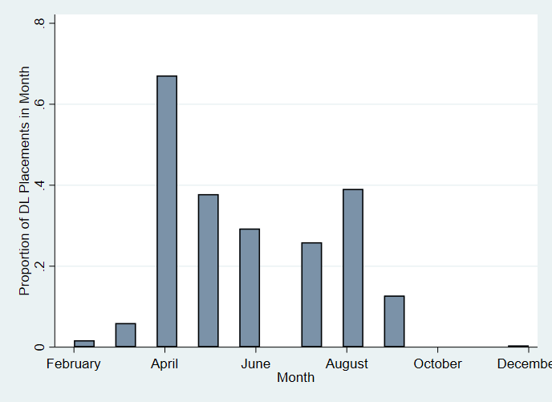
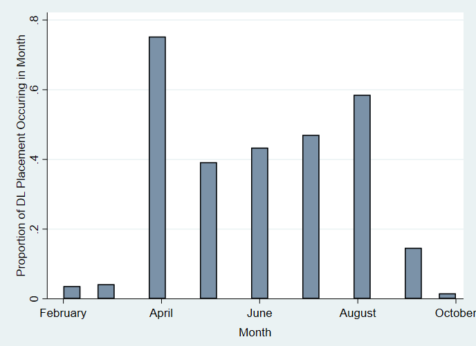
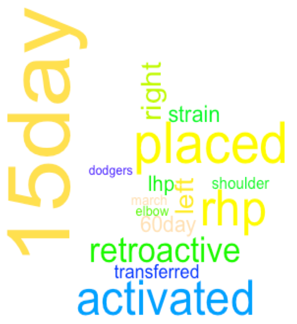
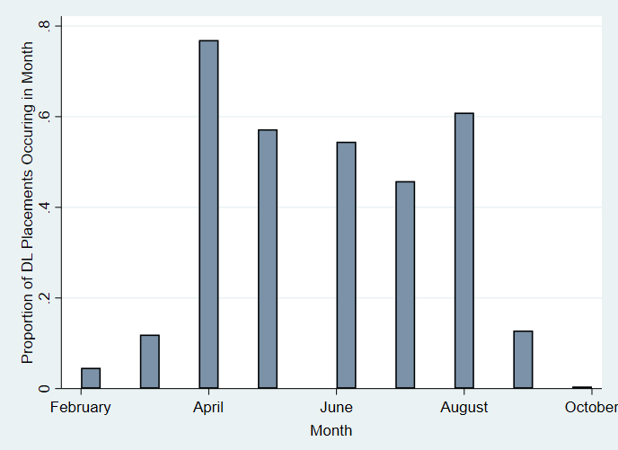

```{r setup, include=FALSE}
knitr::opts_chunk$set(echo = TRUE)
```

# Milestone 3

## Basic Information {width=30px}  

**Project Title:** Major League Baseball Player Injuries from 2015-2017   
**Author Name:** Lacey Gleason  
**Email Address:** lpgleas@emory.edu  

## Introduction {width=30px}  
### Background   

Despite improvements in technology used for athletic conditioning and medical treatment, injuries to Major League Baseball (MLB) players have not declined over time (Conte et al., 2001). In fact, both the frequency and length of disabled list (DL) assignments increased from 1998-2015 (Conte et al., 2016). In addition to the physical and psychological toll, injuries to MLB players have an enormous financial cost. The annual cost of designating players to the disabled list is estimated at $423 million (Conte et al., 2016). One of the contributing factors to the high cost is that baseball contracts are fully guaranteed, and an injury involves the need to pay a player who is not playing in addition to paying for his replacement. Injuries to star players also likely impact viewership and other metrics important to MLB teams, but these indirect consequences have not been the focus of study.
 
In addition to the cost to MLB clubs and players, baseball injuries are important to understand because there has been an increase in the number of injuries in youth baseball in recent years as well (Erickson et al., 2016). The majority of previous studies on baseball injuries have evaluated risk factors in youth baseball players, and pitchers are the most frequently studied (Erickson et al., 2016). Among pitchers, some injury risk factors that have been identified include pitching all year, pitching more than 100 innings per year, high pitch counts, pitching for multiple teams, pitching on consecutive days, pitching while fatigued, pitching with higher velocity, and a variety of elbow and shoulder kinetics (Erickson et al., 2016; Fleisig, 2017). Additional risk factors include pitching without adequate rest, poor mechanics, and throwing high numbers of breaking or off-speed pitches (Makhni et al., 2017). Due to these findings, MLB and USA Baseball created the Pitch Smart program to provide recommendations on pitch counts and rest days (Fleisig, 2017; Erickson et al., 2016).

Repetitive microtrauma has been proposed as the physiological pathway for many of these injuries (Erickson et al, 2016). Specifically, studies have used a previous season's work metrics to predict injury based on the cumulative damage injury model (Karakolis et al., 2013). However, little work has been done to evaluate whether the findings from youth baseball hold true for MLB players. It is difficult to extrapolate results to MLB players due to differences in preparation, length of the seasons, and quality of the athletes (Posner et al., 2011). One study which examined whether or not throwing a complete game in the MLB was a risk factor for being placed on the disabled list found that being a high-volume pitcher in general increased the risk of spending time on the DL (Erickson et al., 2018). However, another study focusing on MLB players found that no cumulative work metric was a significant predictor of future injury (Karakolis et al., 2013). Thus, uncertainty remains about the effect of cumulative work on MLB players’ injuries. 

It is known that there are differences in injury patterns based on player position. Pitchers suffer from a disproportionately greater number of disability days compared with position players (Posner, 2011). Pitchers are also more likely to suffer from upper extremity injuries than position players, and about a quarter of those injuries are related to the elbow (Sonne & Keir, 2016). Incomplete and unstandardized reporting of injury information in disabled list transactions makes it difficult to look at injury type as an outcome in studies of MLB disabled list transactions.

In order to be placed on the disabled list, a player must be certified as unable to play and receive a diagnosis from the team doctor (Posner et al., 2011). Once on the DL, a player cannot return to active play for a specified number of days depending on the type of disabled list used (i.e., 7 days for the 7-day DL, 10 days for the 10-day DL, and 60 days for the 60-day DL). Once a player is placed on the disabled list, the team may replace him on the 25-man roster, which allows the team to play with a full roster of individuals who may be utilized in a game rather than having an injured player take up a bench spot. 

It is particularly important to understand MLB injuries better because recent changes adopted by the MLB in 2015 to increase the pace-of-play may have an impact on fatigue for pitchers (Sonne & Keir, 2016). These changes specifically limit the amount of time that a pitcher may take in between pitches, which decreases within-game rest time that is thought to be protective against injury. MLB players and owners negotiated another recent policy change in their collective bargaining agreement (CBA) in 2016. The new CBA changed the 15-day disabled list to a 10-day disabled list, which may change the frequency and duration of DL assignments (Petriello, 2016). These changes, along with the fact that published studies have focused on time periods up to 2015, leave a gap in understanding about the current utilization of the DL by MLB teams and player characteristics related to injury and DL placement. The aim of this study is to describe DL utilization between 2015 and 2017 and determine player characteristics and usage data from the 2016 season that help explain DL placement in 2017 season.

## Methods {width=30px}  

### Research Question & Hypotheses 

The focal question that I am trying to answer is what Major League Baseball player characteristics and usage data from the 2016 season are associated with placement on the disabled list during the 2017 season. Based on previous literature, I hypothesize that cumulative work metrics, player position (i.e., pitcher), playing for multiple teams, and previous injury are associated with placement on the disabled list. The reasons for including cumulative work measures are covered in the background section, and it would be hypothesized that a higher burden of work would be associated with greater injury. Player position is thought to be related to injury because player position is directly related to exposure to physical wear and tear (e.g., torque forces on the upper extremities for pitchers) and to collisions (e.g., catchers and baserunners on scoring plays have a higher collision risk, outfielders are more likely to collide with walls than infielders). The proposed mechanism for multiple teams being associated with injury is that having been traded or been released and resigned would result in inconsistent player management (especially for pitchers) and disruption of routine training and preparation. While there is evidence to suggest that player size, pitch type, pitch characteristics (e.g., velocity, spin rate), and artificial turf in the player’s home stadium may be associated with injury, these variables were not included in the first iteration of this analysis due to time constraints related to acquiring and cleaning additional datasets. A multiple logistic regression was performed to predict probability of a player being placed on the disabled list in 2017. The explanatory variables included in the model are listed below.

#### Key constructs, measures, and data sources for explanatory variables
| Construct | Measure | Data Source |
|:-----------:|:--------------|:----------------|
| Cumulative work | Total innings played in 2016 | MLB.com player statistics |
| Exposure to injury | Player position categorized as pitcher, infielder, outfielder, catcher, or designated hitter | All |
| Team | 3 Letter abbreviation of MLB team based on MLB.com’s team abbreviations | All |
| Previous injury | Placed on disabled list in 2016 | MLB.com transaction data |
| Played for multiple teams | Concordance between team in 2016 and 2017 | MLB.com player statistics |

### Data Cleaning

#### Data Cleaning Tools
Data cleaning was conducted in both R Studio and Stata. Within R Studio, the packages `plyr` and `dplyr` were primarily used to conduct text analysis and pull necessary pieces of information out of the DL transaction data from MLB.com. The `wordcloud` and `RColorBrewer` packages were used to create word clouds based on the disabled list transaction text. Stata was used to collapse the DL transaction data so that one row appeared per player per year, to match players between the DL transaction data and player statistics data from the same seasons, and then to merge data from multiple years. The data were then imported back into R Studio where the multiple logistic regression was run. The `rmakrdown` package was used to generate this report. Additional packages used include `readxl`, `tm`, and `NLP`.

####Inclusion criteria 
In any research project on MLB injury, it is necessary to define which players will be included and how players will be included across seasons. Some researchers have distinguished between players (i.e., appeared in at least 1 MLB game) and established players (i.e., appeared in 10 MLB games or more in a single season) (Makhni et al., 2014). For the descriptive statistics, I have included all players who had a single appearance in 2015, 2016, or 2017 or who were placed on the disabled list in one of these three seasons. This means that players who only played a single game or single inning would be included. The reason for including all of these players is to be as representative as possible and not limit the sample to those players who played in all three seasons since there is significant churning between seasons. Also, since players who are placed on the disabled list may miss an entire season or more, excluding people who did not play a single game but were placed on the DL would exclude many of the individuals who have repeated DL placements in consecutive seasons. Disabled list information is occasionally available for individuals who do not end up having a single MLB game appearance in a season if they were placed on the DL early in the season or if they were in transition between the majors and minors. The majority of these are likely carry-over placements from injuries in the previous year or resulting from injuries sustained during training in the offseason. For the logistic regression model, players are only included if they had information available for both 2016 and 2017.

####Duplicate transactions
There were several challenges that made it difficult to use the transaction data from MLB.com. One challenge is that retroactive transactions seem to have occasionally produced duplicate transactions both on the date of the actual transaction and on the date to which the disabled list placement was retroactive. I am not sure if this is a bug in the system for generating the transaction table, but it did result in duplicates. Any time that there were consecutive placements or activations, the record was manually checked via the player's MLB.com page to verify the information. Depending on the year, 3%-10% of transactions had some sort of inconsistency that required verification.

####Matching Player Names
Names with more than one last name like "Rubby De La Rosa" are denoted differently in the MLB transaction list and in the MLB.com player statistics data. In this case "De"" showed up as the full last name on one data source and as only part of the last name (merged with LaRosa) in another data source. A similar issue occurred with Scott Van Slyke and Tommy La Stella who each showed up as multiple different players. Names were also difficult to deal with because a number of players shared the same first initial, last name, and position. A unique identifier was thus created from the player’s first initial, last name, and team. This identifier was then used to merge disabled list transaction data with MLB.com player statistics.

####Team Names
Another difficulty that arose in matching players between datasets is that the names of teams were abbreviated differently. For example, the Chicago White Sox were abbreviated as both CWS and CHW. Similarly, the Kansas City Royals were alternatively KAN and KC. All abbreviations were converted to match the abbreviation structure used in the MLB.com player statistics data. Team names also presented a challenge in merging players between years and collapsing multiple DL transactions for a single player in one year due to the fact that a number of players played for multiple teams within any given year or across years. Since the DL transaction data for each year were collapsed based on a unique identifier created from the player's first initial, last name, and team, this lead to multiple rows per player when the player played for multiple teams within the year. After collapsing the data sets, they were reviewed to see if there were any duplicate first initials and last names. When duplicates were discovered, the info for each unique player was aggregated such that only a single row occurred per unique player. A similar review process was conducted after merging DL transaction data with player stats to ensure that there was only a single record per player that was reflective of their aggregate numbers from all teams on which they played during that year.

####Structure of DL encounters  
Another limitation of the transaction data is that the injury information is not structured consistently. For example, one of the 7-day disabled list transactions in 2015 did not mention concussion even though the 7-day disabled list is used exclusively for concussions. This transaction did not contain any information on the type of injury. When I looked up the player to check the type of injury, the player did in fact have a concussion after being struck in the neck with a fly ball. Thus, while the data from MLB.com transactions appear to be very accurate, there are instances in which information is missing. As a result, the proportions of different types of injury mentioned in this report should be interpreted with some skepticism. Another challenge related to the injury information being unstructured is that there are many different ways of denoting each injury. For example, many transactions simply said shoulder injury, while others said labrum surgery or AC joint surgery. The labrum is a ring of cartilage that supports the shoulder, and the acromioclavicular (AC) joint is at the top of the shoulder. Thus, it would require substantial knowledge of these injuries to allow for automatic classification of the injuries that captures all the possible iterations. It is also possible that some of these surgeries are described incorrectly. For example, some of those listed as elbow surgeries may in fact have been Tommy John Surgeries/UCL reconstructions.

## Results {width=30px} 
### Disabled List Transactions in the 2015 MLB Season
####DL Transactions Overall
In 2015, there were 1,018 MLB Disabled List transactions. Of these, 518 (51%) were placements, 113 (11%) were transfers, and 387 (38%) were activations. Of the DL placements, 286 (55%) were retroactive placements. The median difference between the transaction date and the retroactive date of placement was 3 days. There were 442 unique players involved in these transactions, and they were involved in a median of 2 transactions each (IQR 2-4, range 1-7). Players with any DL transaction in the year had a median of 1 placement during the year (IQR 1-2, range 1-3). Placements on the DL were most common in April (31%) and August (18%). Transfers were most common in May (21%) and April (19%). Activations were most common in November (20%) followed by September (18%). The figure below shows the proportion of the year’s DL placements that occurred in each month. Months are missing if there were no DL placements in that month.

####Proportion of Total DL Placements Made in Each Month of 2015



####Position
| Position       | Frequency and percent of DL placements in 2015                           |
|:-----------:|:----------------------------------------------------------------------------|
| Catcher | 33 (6%) |
| Designated Hitter | 3 (<1%) |
| Infielder | 93 (18.0%) |
| Outfielder | 99 (19%) |
| Pitcher | 290 (56%) |
*Numbers above reflect unique placements but not necessarily unique players at each position

####Side of body injured
Only 80% of the DL placements noted the side of injury. Of those that did note a side, 53% involved the right side of the body while 47% involved the left side of the body. It is appropriate that not all DL transactions list side as some injuries, like concussions or groin injuries, do not involve a particular side of the body.

####Concussions
Fifteen (3%) of the 518 DL placements in 2015 mentioned concussions. No designated hitters were involved in DL placements for concussions in 2015. Catchers and outfielders had highest proportion of concussion-related DL placements with 6% of DL placements for catchers and outfielders involving concussions compared with 5% of DL placements for infielders and <1% of DL placements for pitchers. However, the numbers overall were low. All of the 7-day DL placements involved concussions although it was not noted in one transaction description, and 4 (<1%) of the 15-day DL placements involved concussions. 

####Tommy John Surgery
In 2015, 26 (5%) of the 518 DL placements mentioned Tommy John surgery (TJS) or ulnar collateral ligament (UCL) reconstruction. Twenty-five (96%) of these 26 were DL placements of pitchers. Most of these placements (73%) were made in April in 2015.

####Overall Surgery
Overall, 50 (10%) of the 518 DL placements mentioned surgery. Thirty-seven (74%) of these 50 were DL placements of pitchers. In addition to Tommy John Surgery mentioned above, other types of surgery included shoulder/labrum/UC joint (7), other elbow (6), knee (4), core muscle (2), ankle (2), hip (2), back (1), and thoracic outlet syndrome surgery (1). Most of these placements happened in April (74%). The Texas Rangers stood out as a team that had 6 surgery-related DL placements during 2015, but all 30 teams had at least one.

####Team
In 2015, the San Francisco Giants had the most DL placements at 26. The next highest were the Los Angeles Dodgers (25), New York Mets (24), and Texas Rangers (24). The team with the fewest DL placements in 2015 was the Seattle Mariners (7).

####Word Cloud for DL Transactions in 2015
After removing common words (e.g., the, Los, disabled), the following word cloud was generated based on the disabled list transaction descriptions in 2015. The size of each word is proportional to its frequency of use in the transaction data.

{width=250px}  


### Disabled List Transactions in the 2016 MLB Season

####Number and Type of DL Transactions
In 2016, there were 1,139 MLB Disabled List transactions. Of these, 550 (48%) were placements, 135 (12%) were transfers, and 454 (40%) were activations. Of the 550 DL placements, 310 (56%) were retroactive placements. The median difference between the transaction date and the retroactive date of placement was 3 days. There were 483 unique players involved in these transactions, and they were involved in a median of 2 transactions each (IQR 2-4, range 1-8). When only looking at DL placements, players had a median of 1 placement during the year (IQR 1-2, range 1-4). Placements on the DL were most common in April (26%) and August (20%). Transfers were most common in August (22%) and July (19%). Activations were most common in September (18%) followed by August (17%).

####Proportion of Total DL Placements Made in Each Month of 2016
The figure below shows the proportion of the year’s DL placements that occurred in each month. Months are missing if there were no DL placements in that month in 2016.




####Side of body injured
Only 80% of the DL transactions noted the side of injury. Of those that did note a side, 53% involved the right side of the body while 47% involved the left side of the body. These proportions exactly matched those from 2015.

####Position
| Position       | Frequency and percent of DL placements in 2015                           |
|:-----------:|:----------------------------------------------------------------------------|
| Catcher | 44 (8%) |
| Designated Hitter | 4 (<1%) |
| Infielder | 90 (16%) |
| Outfielder | 113 (21%) |
| Pitcher | 299 (54%) |
*The numbers above represent unique DL placements but not necessarily unique players at each position

####Concussions
Ten (2%) of the 550 DL placements in 2016 mentioned concussions. No pitchers or DHs were involved in DL placements for concussions in 2016. Catchers had the highest proportion of concussion-related DL placements with 7% of DL placements for catchers involving concussions compared with 3% of DL placements for infielders and 4% of DL placements for outfielders. However, the numbers overall were low. As expected, all of the 7-day DL placements involved concussions and 2 (<1%) of the 15-day DL placements involved concussions. 

####Tommy John Surgery
In 2016, 20 (4%) of the 550 DL placements mentioned Tommy John surgery (TJS) or ulnar collateral ligament (UCL) reconstruction. Nineteen (95%) of these 20 were for DL placements of pitchers. Most of these placements actually happened in the offseason, presumably following surgery.

####Overall Surgery
Overall, 33 (6%) of the 550 DL placements mentioned surgery. Twenty-five (76%) of these 33 were DL placements of pitchers. In addition to Tommy John Surgery mentioned above, other types of surgery included shoulder/labrum (8), other elbow (2), core muscle (1), ankle (1), rib (1), groin (1), and back surgery (1). Most of these placements happened in April (76%) and 15% happened in the offseason (February and March). 

####Team
In 2016, over 6% of DL placements were for Dodgers players. The Dodgers had 8 more DL placements than the next highest team (OAK) and 26 more DL placements than the lowest team (HOU).

####Word Cloud for DL Transactions in 2016
After removing common words (e.g., the, Los, disabled), the following word cloud was generated based on the disabled list transaction descriptions in 2016. The size of each word is proportional to its frequency of use in the transaction data.

{width=350px}

### Disabled List Transactions in the 2017 MLB Season
#### Number and Type of DL Transactions
In 2017, there were 1,386 MLB Disabled List transactions. Of these, 710 (51%) were placements, 133 (10%) were transfers, and 543 (39%) were activations. Of the 710 DL placements, 306 (43%) were retroactive placements. The median difference between the transaction date and the retroactive date of placement was 2 days. There were 537 unique players involved in these transactions and they were involved in a median of 3 transactions each (IQR 2-4, range 1-9). When only looking at DL placements, players had a median of 1 placement during the year (IQR 1-2, range 1-5). Placements on the DL were most common in April (24%) and August (19%). Transfers were most common in May (23%) and June (19%). Activations were most common in June (17%) followed by August (15%) and September (15%). There were no disabled list transactions in January or December of 2017.

####Proportion of Total DL Placements Made in Each Month of 2017
The figure below shows the proportion of the year’s DL placements that occurred in each month. Months are missing if there were no DL placements in that month in 2017.



#### Side of body injured
Only 73% of the DL transactions noted the side of injury. Of those that did note a side, 60% involved the right side of the body while 40% involved the left side of the body.

#### Position
| Position       | Frequency and percent of DL placements in 2017                           |
|:-----------:|:----------------------------------------------------------------------------|
| Catcher | 51 (7.2%) |
| Designated Hitter | 8 (1.1%) |
| Infielder | 131 (18.5%) |
| Outfielder | 133 (18.7%) |
| Pitcher | 387 (54.5%) |
*Numbers above reflect unique placements but not necessarily unique players at each position

#### Concussions
Forty (6%) of the 710 DL placements in 2017 mentioned concussions. No designated hitters were involved in DL placements for concussions in 2017. Catchers and outfielders had highest proportion of concussion-related DL placements with 29% of DL placements for catchers and 11% of DL placements for outfielders involving concussions compared with 7% of DL placements for infielders and <1% of DL placements for pitchers. All of the 7-day DL placements involved concussions, and 14 (2%) of the 10-day DL placements involved concussions.

#### Tommy John Surgery
In 2017, 12 (2%) of the 710 DL placements mentioned Tommy John surgery (TJS) or ulnar collateral ligament (UCL) reconstruction. Eleven (92%) of these 12 were for DL placements of pitchers. Forty-two percent of TJS-related DL placements happened in April.

#### Overall Surgery
Overall, 23 (3%) of the 710 DL placements mentioned surgery. Sixteen (70%) of these 23 were DL placements of pitchers. In addition to Tommy John Surgery mentioned above, other types of surgery included shoulder (3), other elbow (3), hip (2), unspecfied arm (2), foot (1), thoracic outlet syndrome (1), appendix (1), achilles (1), colon (1), knee (1), and biceps (1) surgeries. One of the surgeries was listed as both shoulder and biceps. Most of these placements happened in April. Five of the Tommy John surgeries did not mention surgery in the DL transaction. Thus, the number of surgeries should be at least 28 (4% of DL placements).

####Team
In 2017, 6% of DL placements (41 total) were for Dodgers players. The Dodgers had 8 more DL placements than the next highest team (TOR) and 29 more DL placements than the lowest team (CHC).

####Word Cloud for DL Transactions in 2017
After removing common words (e.g., the, Los, disabled), the following word cloud was generated based on the disabled list transaction descriptions in 2017. The size of each word is proportional to its frequency of use in the transaction data.

{width=350px}

### Logistic regression for DL placement in 2017
```{r}

library(readxl)

combined <- read_excel("2016_2017_combined_all.xls", 
     sheet = "Sheet1")

# logistic regression - placed on the DL in 2017 or not
DL17 <- glm(place_17 ~ place_16 + surg_16 + INN_16 + pitch_16 + concordance, family=binomial(link="logit"), data = combined)
summary(DL17)

exp(DL17$coefficients)

exp(confint(DL17))

```
#### Results of logistic regression predicting placement on DL in 2017
| Characteristic       | OR (95% CI) | p-value |
|:-----------------------|:----------------:|:---------:|
| Placed on DL in 2016 | 2.21 (1.69, 2.88) | <0.001 |
| Surgery in 2016 | 0.83 (0.67,10.6) | 0.221 |
| Innings played in 2016 | 1.0006 (1.0002, 1.0010) | 0.002 |
| Pitcher in 2016 | 1.81 (1.28, 2.56) | <0.001 |
| Same team in 2016 and 2017 | 1.38 (1.05,1.81) | 0.022 |

Having been placed on the DL in 2016, having played more innings in 2016, being a pitcher, and having played for the same team in 2016 and 2017 were all significantly associated with higher odds of being placed on the DL in 2017. Controlling for DL placement in 2016, having had surgery in 2016 was not significantly associated with DL placement in 2017.

## Discussion {width=30px} 
These results are in line with previous literature that suggests that April is the most common month for MLB injuries and that there is a steep drop off in DL placements in September (Erickson et al., 2016). The greater number of injuries in April is thought to be due to deconditioning and overload (Posner, 2011). Also, fewer players may be placed on the DL in September because teams are allowed to expand their rosters to 40 men and may not be forced to make DL placements in order to have sufficient depth on the bench (Posner, 2011). It is difficult to draw conclusions about changes in the relative proportion of DL transaction types between seasons because these transactions are interconnected. For example, if there is a high proportion of DL placements in one year, there may be a higher than average proportion of activations in the following year depending on the timing and duration of injuries.

The numbers of players placed on the DL in 2015 and 2016 were consistent with previous studies which reported an average of 438-464 designations annually (Posner, 2011; Conte et al., 2016). However, there does appear to be an increase in DL placements in 2017, and the change in distribution of injury type (i.e., disproportionate increase in concussions) merits further investigation.

These results confirm previous findings that player position influences disabled list placement and type of injury (e.g., pitchers were disproportionately represented in transactions involving surgery and, more specifically, in transactions involving upper extremity surgery). Further investigation would be required to see if the uptick in concussions in 2017 is related to acute collision injuries between baserunners and catchers, which has been hypothesized in previous research, or whether it could be an effect of better ability to detect concussions (Erickson et al, 2016). 

The positive association between innings played and placement on the DL in the following season is consistent with some previous studies but contradicts other. Even though the effect here appears to be small per inning, many innings are played throughout the season. This finding could be interpreted more readily if separate models were run for pitchers and position players and if a variety of cumulative work metrics were tested. Especially for pitchers, the overall volume of innings may not end up mattering as much as the rest time between appearances. In some cases, more playing time has even been associated with reduced likelihood of DL placement because a deterioration in play that results in reduced playing time may proceed more obvious signs of injury. The nuances of the relationship between playing time and injury risk highlight the need for careful interpretation.

It is unclear why the Dodgers have so many more DL placements than other teams in 2016 and 2017. While it may be bad luck, there is also a possibility that the difference in the number of DL placements is the result of a management strategy. When the DL was changed from a 15-day list to a 10-day list in 2016, some baseball analysts suggested that teams may use the 10-day DL as a way to rest pitchers that would only require them to miss a single start and at the same time would open up a roster position for a fresher pitcher to rotate in (Petriello, 2016). More in-depth analysis would be required to understand how differences in DL placements may relate to management strategy and differential use of pitching staffs (e.g., higher reliance on relievers and strategic matchups, early removal of starters to limit batter OPS after two times through the batting order, tendency to use additional roster spots for pitchers rather than utility position players). 

## Limitations {width=30px} 
A significant portion of DL transactions were not complete within a single calendar year. For example, 29% of the DL transactions in 2015, 28% of the DL transactions in 2016, and 27% of the DL transactions in 2017 were incomplete. This means that the last DL transaction for the player in the year was a placement or that the first DL transaction for the player in the year was an activation. I addressed this limitation by focusing on placement on the DL as the outcome of interest. In the future, if I want to include the number of days spent on the DL, I will need to complete the transactions that cross years or consider defining the year in a way that better suits baseball transaction activity rather than the calendar year. Similar limitations apply to seasons that were split between the minor leagues and major leagues. In future analysis, data from MiLB could be included so that rookies are not kicked out of the model for missing data. This would allow for investigation of service time effects on DL placement.

Some of the changes in type of injury might have to do with changes in the ability to detect injuries. As mentioned above, the spike in concussions between 2016 and 2017 may be due to a change in the concussion protocol. In a more thorough study, policy changes would be incorporated into the analysis to better understand difference between seasons. There are also other changes between years that may be of significant interest, such as a change in the playing style from small-ball eras to home-run eras, an increase in the prevalence of "flamethrower" pitchers, or changes in bullpen utilization patterns. Changes in medical technology could also affect how many players with the same injury end up getting surgery from one year to the next. Medical technology could also affect how many players are able to return to competition following surgery, which could be associated with higher risk of re-injury and subsequent DL placements (Conte et al., 2001; Makhni et al., 2014). In this way, the success of medical treatment may actually contribute to higher DL placement rates over time.

##Future Research {width=30px} 
#### Create separate models for pitchers vs. other players
In the future, I would like to create separate models for pitchers and position players in order to focus on characteristics that are likely to be specifically related to injury risk factors at that position. Creating two separate models would also allow for the inclusion of better cumulative work metrics as pitcher work can be measured differently than work for position players (e.g., pitches thrown or batters faced vs. at-bats or innings played in the field). This separation would also allow for investigation of rest-time for pitchers by including information about time between appearances for both starting and relief pitchers. This would not be applicable for position players who regularly appear in consecutive games and do not participate in every play.

#### Incorporation of Statcast data
As a next step, I would like to include additional characteristics in my model that have been implicated in the literature as potentially important, including pitch velocity and pitch type. Statcast, which began in 2015, collects data on pitch velocity, pitch rotation, pitch location, and pitch type breakdowns.

#### Better data are on the way!
The MLB recently created an electronic medical record and Health and Injury Tracking System called HITS for both the MLB and MiLB (Conte et al., 2016). This new database will allow for improved analysis of baseball injuries in the future. In addition to better documentation of injuries, there are continually improved sources of information about baseball game play. For example, the Pitch f/x video tracking system now analyzes over 60 variables on each of the approximately 660,000 pitches thrown in the MLB each year (Conte et al., 2016). In addition to markerless optical motion tracking, one of the most exciting developments in research related to baseball injury is the invention and adoption of wearable devices. The mTHROW sleeve is an elastic sleeve worn by pitchers that measures torque, velocity, and workload on pitchers’ dominant arms through use of an accelerometer (Erickson et al., 2016). The accuracy of this device has been validated through comparison with optical motion capture, which is the current gold standard. (Fleisig, 2017). This sleeve sends the data to a smart device (e.g., tablet, cell phone) in real time and reduces the need for expensive equipment (Makhni et al., 2017).  As these new technologies allow for more complete and accurate measurement of injury risk factors among MLB players, there is greater potential than ever to understand and eventually reduce the incidence of baseball injuries.

## Link {width=30px} 
The link for this file is located at <https://github.com/lpgleason/Project.git>.

## References


